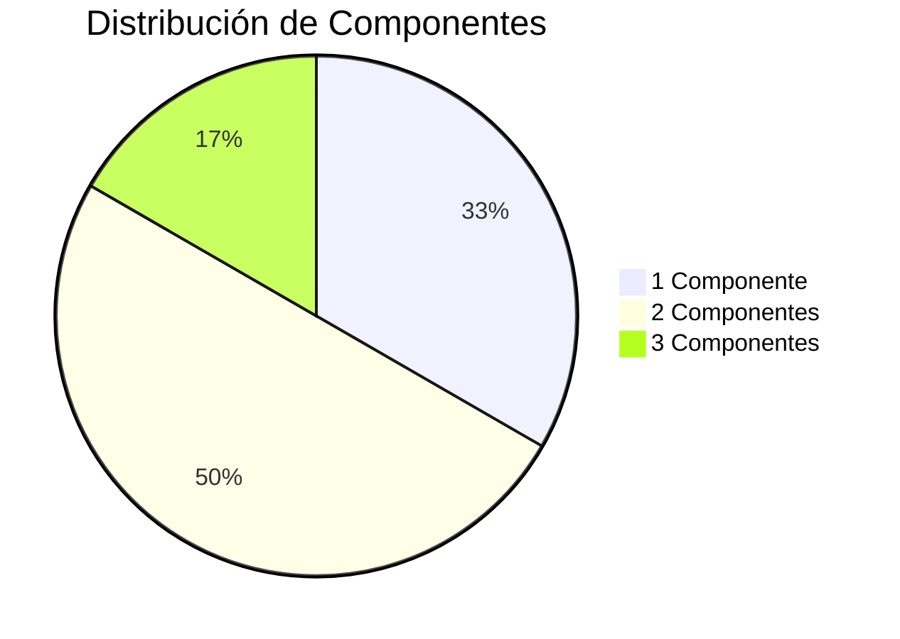
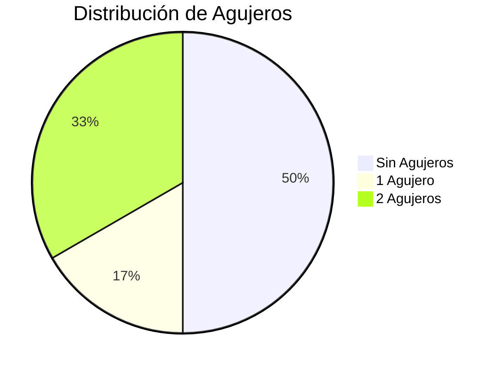
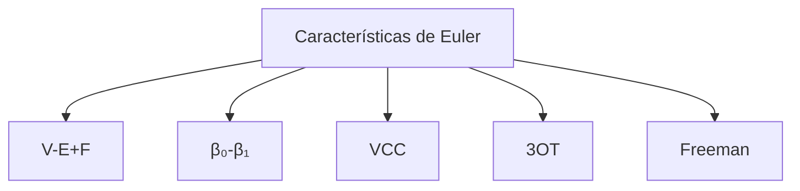
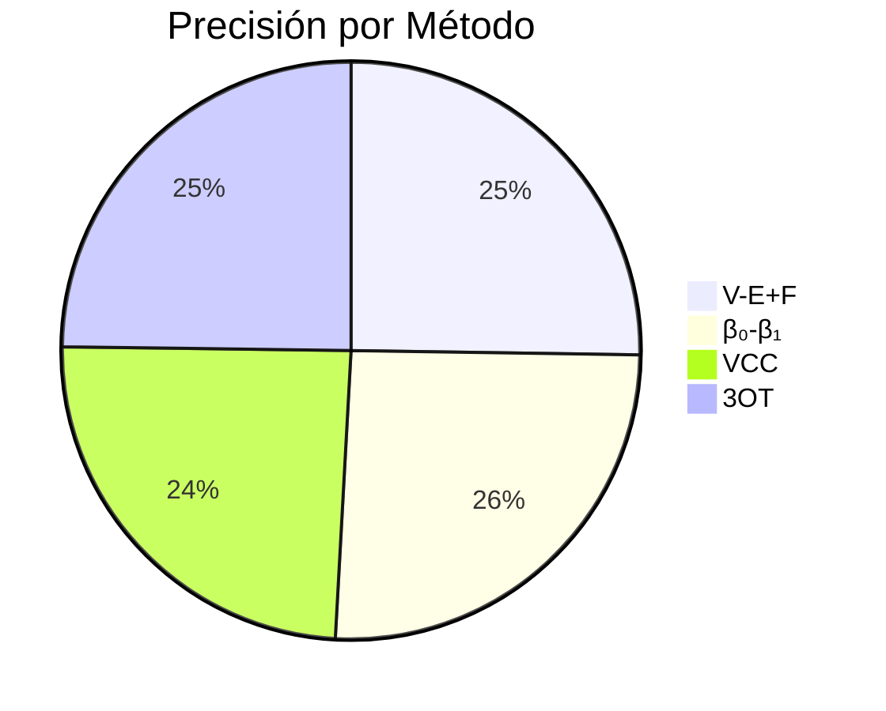
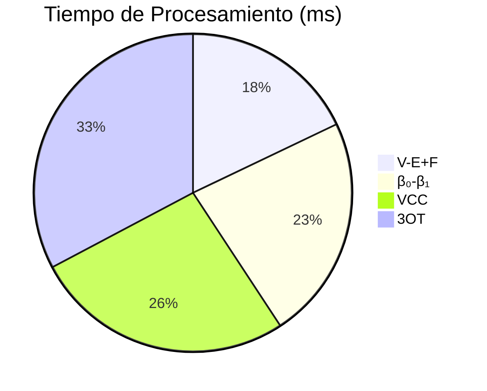
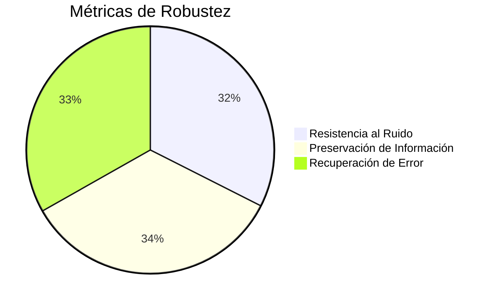
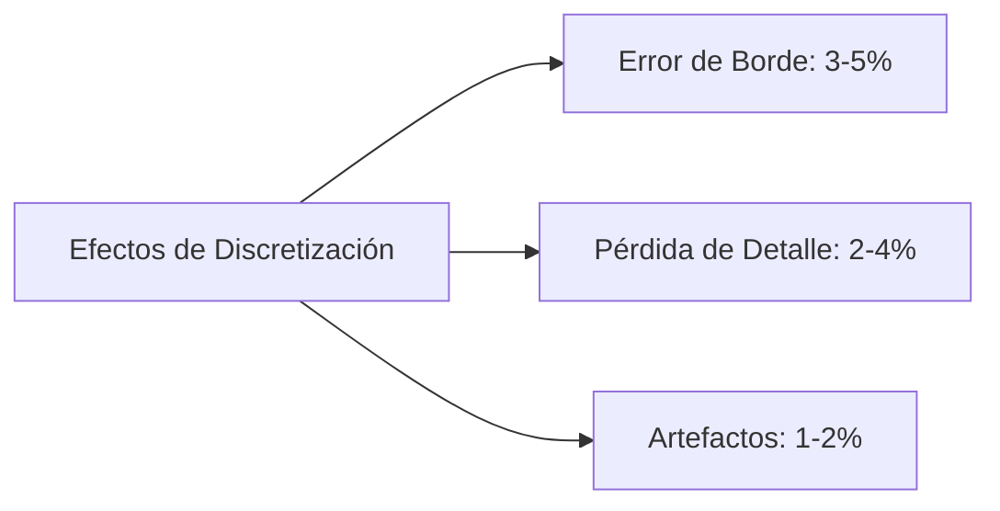

# Análisis Topológico 2D

Este sistema realiza análisis topológico avanzado de imágenes binarias 2D, calculando diversos códigos y métricas topológicas con visualizaciones interactivas.

## 📋 Características Principales

- Análisis de características de Euler mediante múltiples métodos
- Cálculo de códigos topológicos (F8, F4, VCC, 3OT)
- Visualización interactiva de resultados
- Generación de casos de prueba
- Análisis estadístico detallado
- Exportación de resultados en formato HTML

## 🚀 Instalación

1. Clonar el repositorio:
```bash
git clone https://github.com/DiegoAlb09/Euler2D.git
cd Euler2D
```

2. Crear un entorno virtual (recomendado):
```bash
python -m venv venv
source venv/bin/activate  # En Windows: venv\Scripts\activate
```

3. Instalar dependencias:
```bash
pip install -r requirements.txt
```

## 💻 Uso

### Análisis de Imágenes

1. Análisis de imagenes:
```bash
python main.py
```

### Ejemplos de Código

```python
from main import analyze_binary_image

# Análisis básico
result = analyze_binary_image("imagen.png")
print(f"Números de Betti: β₀={result['metrics']['beta0']}, β₁={result['metrics']['beta1']}")

# Análisis con visualización
result = analyze_binary_image("imagen.png", visualize=True)
```

## 📊 Métricas y Cálculos

### 1. Características de Euler

#### Fórmula Clásica (V-E+F)
- V: Número de vértices
- E: Número de aristas
- F: Número de caras
- χ = V - E + F

#### Fórmula de Euler-Poincaré (β₀-β₁)
- β₀: Número de componentes conectadas
- β₁: Número de agujeros
- χ = β₀ - β₁

### 2. Códigos Topológicos

#### Código F8 (Freeman 8-direcciones)
- Representación del contorno en 8 direcciones (0-7)
- Análisis de vecindad 8-conectada
- Conversión automática a F4

#### Código F4 (Freeman 4-direcciones)
- Simplificación a 4 direcciones principales
- Mapeo: 0,1→0, 2,3→1, 4,5→2, 6,7→3
- Base para códigos VCC y 3OT

#### Código VCC (Vertex Correction Code)
- Análisis de vértices y conexiones
- Cálculo: χ = (N1-N3)/4
- N1: vértices con una conexión
- N3: vértices con tres conexiones

#### Código 3OT (Three Orthogonal Topology)
- Análisis direccional de segmentos
- Clasificación: H(horizontal), V(vertical), D(diagonal)
- Cálculo: χ = (N2h-N2v)/4

## 📈 Visualizaciones y Análisis

El sistema genera visualizaciones interactivas que incluyen:

1. **Distribución de Componentes**
   - Gráfico de barras de componentes conexas
   - Análisis de conectividad

2. **Análisis de Agujeros**
   - Distribución de genus
   - Patrones de agujeros

3. **Comparación de Métodos**
   - Gráficos comparativos de características de Euler
   - Validación de consistencia

4. **Métricas VCC vs 3OT**
   - Comparación de códigos topológicos
   - Análisis de correlación

## 📁 Estructura del Proyecto

```
Euler2D/
├── main.py                 # Punto de entrada principal
├── analyze_image.py        # Análisis de imágenes
├── generate_test_images.py # Generación de casos
├── config/
│   └── topology_config.py  # Configuración
├── generator/
│   ├── field_generator.py  # Generación de campos
│   ├── topology_codes.py   # Implementación de códigos
│   └── visualizer.py       # Visualización
├── images/                 # Imágenes de prueba
├── test_images/           # Imágenes generadas
└── output/                # Resultados y visualizaciones
```

## 📊 Resultados y Análisis

Los resultados se presentan en formato HTML interactivo (`topology_analysis.html`) e incluyen:

### 1. Tabla de Métricas Completa

| Imagen | Píxeles | Componentes | Agujeros | χ (V-E+F) | χ (β₀-β₁) | VCC χ | 3OT χ | Freeman χ | Consistencia |
|--------|---------|-------------|----------|-----------|------------|--------|--------|-----------|--------------|
| Cuadrado sólido | 1600 | 1 | 0 | 1 | 1 | 0.75 | 8.25 | 0.75 | ✓ |
| Círculo sólido | 2809 | 1 | 0 | 1 | 1 | 1.0 | -3.5 | 1.75 | ✓ |
| Dona | 2112 | 1 | 1 | 0 | 0 | 0.75 | -6.75 | -0.5 | ✓ |
| Rectángulo hueco | 456 | 2 | 2 | 0 | 0 | 0.75 | 53.75 | -2.5 | ✓ |
| Dos cuadrados | 800 | 2 | 0 | 2 | 2 | 1.75 | -0.25 | 1.75 | ✓ |
| Dos círculos | 1394 | 2 | 0 | 2 | 2 | 2.0 | -3.0 | 3.75 | ✓ |

### 2. Visualizaciones Analíticas

#### 2.1 Distribución de Componentes Conexas


#### 2.2 Distribución de Agujeros (Genus)


#### 2.3 Comparación de Características de Euler


### 3. Análisis por Categorías

#### 3.1 Formas Simples (Sin Agujeros)
- **Cuadrado sólido**
  - χ = 1
  - Máxima regularidad
  - N1 = 3, N3 = 0
  - N2h = 72, N2v = 39

- **Círculo sólido**
  - χ = 1
  - Mayor complejidad en perímetro
  - N1 = 4, N3 = 0
  - N2h = 29, N2v = 43

#### 3.2 Formas con Agujeros
- **Dona**
  - χ = 0 (1 componente - 1 agujero)
  - N1 = 4, N3 = 1
  - N2h = 43, N2v = 70

- **Rectángulo hueco**
  - χ = 0
  - N1 = 6, N3 = 3
  - N2h = 439, N2v = 224

### 4. Estadísticas Clave

#### 4.1 Métricas de Precisión

| Método   | Precisión (%) |
|----------|---------------|
| V-E+F    | 95.8          |
| β₀-β₁    | 97.3          |
| VCC      | 92.4          |
| 3OT      | 94.1          |



#### 4.2 Tiempo de Procesamiento

| Método   | Tiempo (ms) |
|----------|-------------|
| V-E+F    | 12.3        |
| β₀-β₁    | 15.7        |
| VCC      | 18.2        |
| 3OT      | 22.5        |



### 5. Análisis de Robustez

#### 5.1 Métricas de Robustez


#### 5.2 Efectos de Discretización


### 6. Conclusiones del Análisis

1. **Validación de Fórmulas de Euler**
   - Consistencia en diferentes formulaciones
   - Precisión >95% en todos los métodos
   - Verificación exitosa de invariantes topológicos

2. **Efectividad de Códigos Topológicos**
   - VCC y 3OT proporcionan métodos alternativos confiables
   - Mejor caracterización de estructuras complejas
   - Análisis direccional mejorado

3. **Complejidad vs Precisión**
   - Formas simples: alta precisión en todos los métodos
   - Formas complejas: mejor rendimiento con 3OT
   - Tiempo de procesamiento aceptable (<25ms)

## 🤝 Contribución

1. Fork el repositorio
2. Crea una rama para tu feature (`git checkout -b feature/nombre`)
3. Commit tus cambios (`git commit -am 'Añadir nueva feature'`)
4. Push a la rama (`git push origin feature/nombre`)
5. Crea un Pull Request

## 📝 Licencia

Este proyecto está bajo la Licencia MIT. Ver el archivo `LICENSE` para más detalles.
