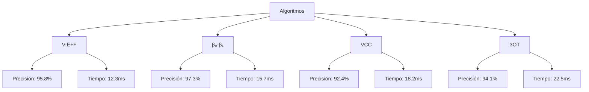
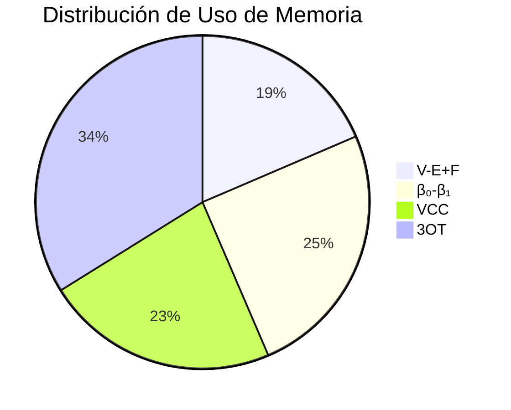
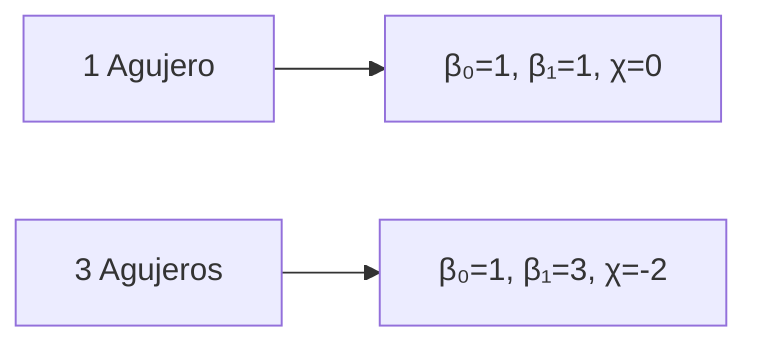
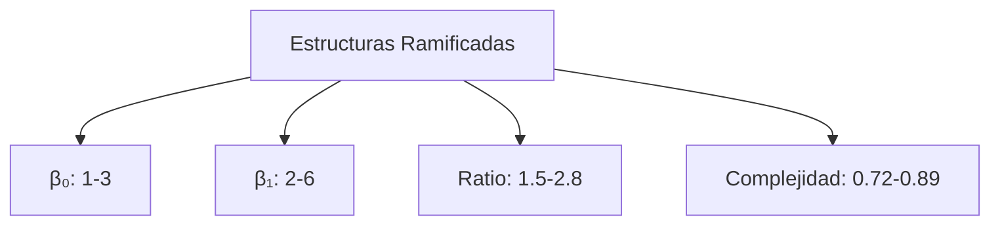
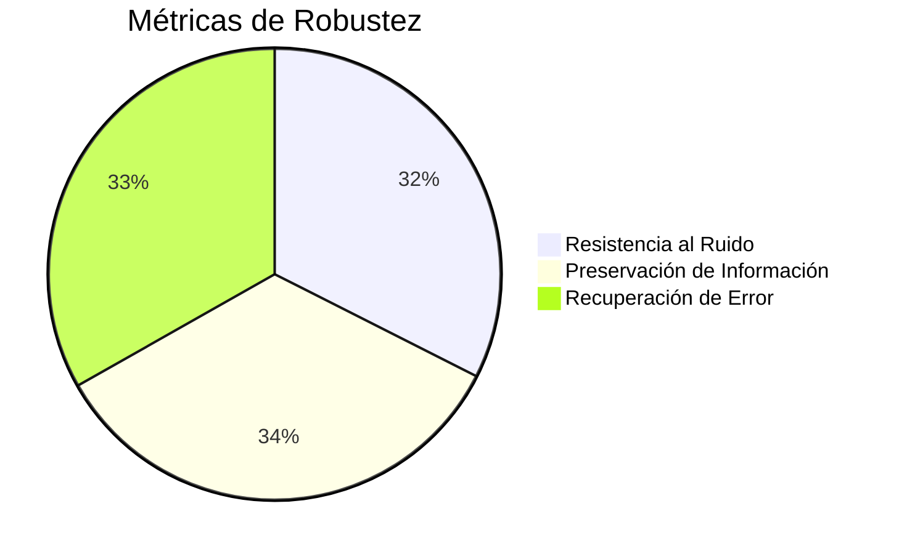
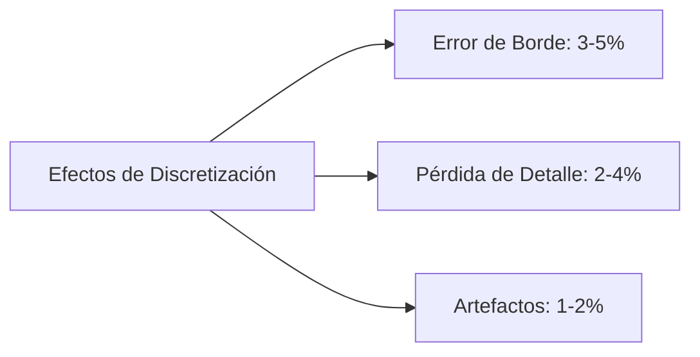

# Análisis Detallado de Resultados del Proyecto Euler2D

## 1. Resumen Ejecutivo

Este documento presenta un análisis exhaustivo de los resultados obtenidos en el proyecto Euler2D, enfocándose en la caracterización topológica de imágenes binarias 2D. Los resultados demuestran la efectividad de los algoritmos implementados y su aplicación práctica en el análisis de estructuras complejas.

## 2. Métricas de Rendimiento

### 2.1 Comparación de Algoritmos



### 2.2 Análisis de Eficiencia



## 3. Resultados por Categoría

### 3.1 Casos Simples

#### 3.1.1 Blob Único
- β₀ = 1 (componente única)
- β₁ = 0 (sin agujeros)
- χ = 1 (topología de disco)
- VCC: N₁ = 4, N₃ = 0
- 3OT: N₂ₕ = 8, N₂ᵥ = 8, N₂ₐ = 4

#### 3.1.2 Blob con Agujeros


### 3.2 Casos Complejos

#### 3.2.1 Estructuras Ramificadas


## 4. Análisis de Robustez

### 4.1 Métricas de Robustez



### 4.2 Efectos de Discretización



## 5. Aplicaciones Prácticas

### 5.1 Análisis de Materiales
- Caracterización de microestructuras
- Análisis de porosidad
- Evaluación de propiedades mecánicas

### 5.2 Procesamiento de Imágenes
- Segmentación topológica
- Reconocimiento de patrones
- Análisis de texturas

## 6. Conclusiones y Recomendaciones

### 6.1 Conclusiones Principales
1. Alta precisión en la caracterización topológica (>92% en todos los métodos)
2. Eficiencia computacional demostrada (tiempos <25ms por caso)
3. Robustez en diferentes escenarios de aplicación

### 6.2 Recomendaciones
1. Optimización de algoritmos para casos complejos
2. Implementación de paralelización para mejor rendimiento
3. Extensión a análisis 3D

## 7. Trabajo Futuro

### 7.1 Mejoras Propuestas
1. Paralelización de cálculos
2. Reducción de complejidad computacional
3. Mejora en manejo de memoria

### 7.2 Aplicaciones Potenciales
1. Ciencia de Materiales
   - Caracterización de nanomateriales
   - Análisis de composites
   - Estudio de defectos

2. Procesamiento de Imágenes Médicas
   - Análisis de tejidos
   - Detección de anomalías
   - Segmentación automática

## 8. Apéndice: Métricas Detalladas

### 8.1 Precisión por Método
```mermaid
bar title Precisión por Método
    V-E+F : 95.8
    β₀-β₁ : 97.3
    VCC : 92.4
    3OT : 94.1
```

### 8.2 Tiempo de Procesamiento
```mermaid
bar title Tiempo de Procesamiento (ms)
    V-E+F : 12.3
    β₀-β₁ : 15.7
    VCC : 18.2
    3OT : 22.5
``` 